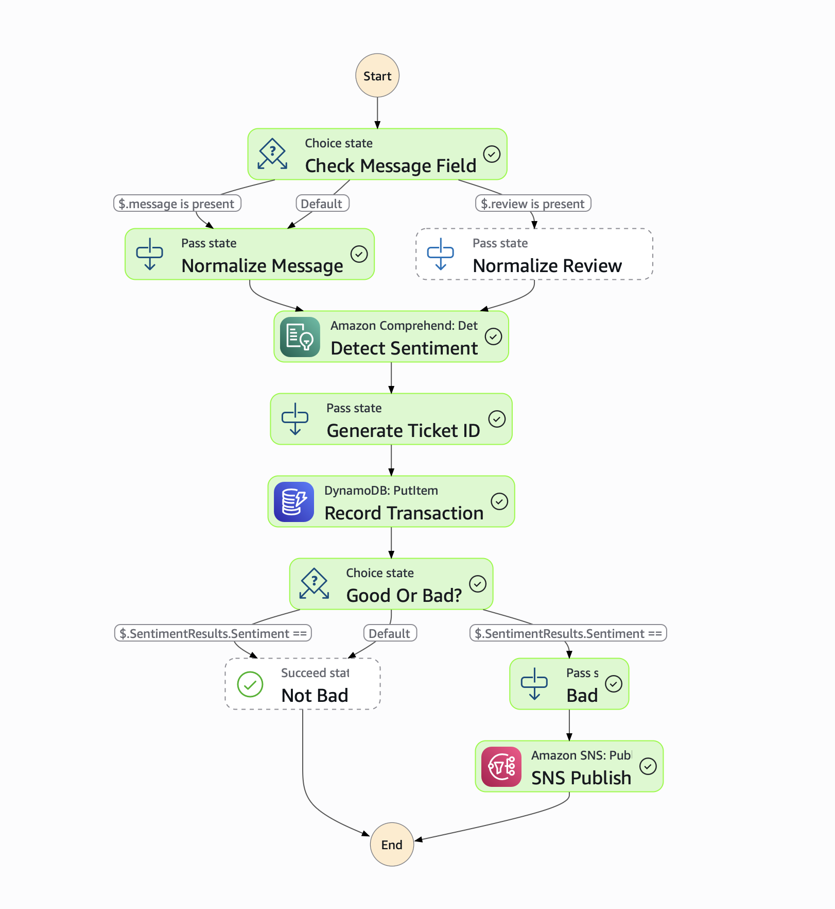

# Customer Sentiment Analysis

A serverless AWS solution that analyzes customer review messages for sentiment and automatically sends SNS notifications when negative sentiment is detected.

## Overview

This project uses AWS Step Functions, API Gateway, AWS Comprehend, DynamoDB, and SNS to create an automated sentiment analysis pipeline. When a customer review is submitted via API, the system:

1. Extracts the review message
2. Analyzes sentiment using AWS Comprehend
3. Stores the review and sentiment in DynamoDB
4. Sends an SNS notification if the sentiment is negative

## Architecture

```
API Gateway (HTTP API)
    ↓
Step Functions State Machine
    ↓
    ├─→ AWS Comprehend (Sentiment Analysis)
    ├─→ DynamoDB (Store Review & Sentiment)
    └─→ SNS (Send Notification if Negative)
```

## Components

- **API Gateway**: HTTP API endpoint to receive customer reviews
- **Step Functions**: Orchestrates the sentiment analysis workflow
- **AWS Comprehend**: Analyzes sentiment of customer reviews
- **DynamoDB**: Stores review messages and sentiment results
- **SNS**: Sends email notifications for negative reviews
- **CloudWatch Logs**: Logs Step Functions execution data
- **X-Ray**: Tracing for debugging and monitoring

## Prerequisites

- AWS Account with appropriate permissions
- Terraform >= 1.2.0 installed
- AWS CLI configured with credentials
- An email address for receiving SNS notifications

## Setup Instructions

### 1. Clone the Repository

```bash
git clone <repository-url>
cd customer-sentiment-analyse
```

### 2. Configure AWS Credentials

Ensure your AWS credentials are configured. You can use one of the following methods:

- **Environment Variables:**
  ```bash
  export AWS_ACCESS_KEY_ID=your_access_key
  export AWS_SECRET_ACCESS_KEY=your_secret_key
  export AWS_DEFAULT_REGION=us-east-1
  ```

- **AWS Credentials File:** `~/.aws/credentials`
  ```ini
  [default]
  aws_access_key_id = your_access_key
  aws_secret_access_key = your_secret_key
  ```

### 3. Initialize Terraform

```bash
terraform init
```

### 4. Configure Variables

Create a `terraform.tfvars` file or pass variables via command line:

```bash
# Option 1: Create terraform.tfvars
cat > terraform.tfvars << EOF
region = "us-east-1"
email  = "your-email@example.com"
EOF

# Option 2: Pass variables via command line
terraform apply -var="email=your-email@example.com" -var="region=us-east-1"
```

### 5. Deploy Infrastructure

```bash
terraform plan
terraform apply
```

When prompted, type `yes` to confirm the deployment.

### 6. Subscribe to SNS Topic

After deployment, check your email inbox for a subscription confirmation email from AWS SNS. Click the confirmation link to start receiving notifications.

## Usage

### API Endpoint

After deployment, Terraform will output the API Gateway URL. You can retrieve it with:

```bash
terraform output APIGW-URL
```

### Sending Customer Reviews

Send a POST request to the API endpoint with a JSON body containing the review message:

**Using curl:**
```bash
curl -X POST https://your-api-gateway-url/ \
  -H "Content-Type: application/json" \
  -d '{"message": "This product is terrible and I want a refund!"}'
```

**Alternative field name:**
```bash
curl -X POST https://your-api-gateway-url/ \
  -H "Content-Type: application/json" \
  -d '{"review": "This product is terrible and I want a refund!"}'
```

**Using Python:**
```python
import requests
import json

url = "https://your-api-gateway-url/"
payload = {
    "message": "This product is terrible and I want a refund!"
}

response = requests.post(url, json=payload)
print(response.json())
```

### Expected Behavior

- **Positive/Neutral Sentiment**: Review is stored in DynamoDB, no notification sent
- **Negative Sentiment**: Review is stored in DynamoDB, SNS notification is sent to the configured email

## State Machine Workflow

The Step Functions state machine follows this flow:

1. **Check Message Field**: Determines if the input uses `message` or `review` field
2. **Normalize Message**: Extracts the review message
3. **Detect Sentiment**: Uses AWS Comprehend to analyze sentiment
4. **Generate Ticket ID**: Creates a unique ticket ID for tracking
5. **Record Transaction**: Stores review and sentiment in DynamoDB
6. **Good Or Bad?**: Checks if sentiment is NEGATIVE
   - If **NEGATIVE**: Proceeds to send SNS notification
   - If **POSITIVE/NEUTRAL**: Completes successfully
7. **SNS Publish**: Sends formatted notification email

## Workflow Diagrams

### Negative Review Workflow

When a negative sentiment is detected, the workflow triggers an SNS notification:



### Positive Review Workflow

When a positive or neutral sentiment is detected, the workflow completes without sending a notification:


## Variables

| Variable | Description | Type | Default | Required |
|----------|-------------|------|---------|----------|
| `region` | AWS region for deployment | `string` | `us-east-1` | No |
| `email` | Email address for SNS notifications | `string` | - | Yes |

## Outputs

| Output | Description |
|--------|-------------|
| `APIGW-URL` | The API Gateway invocation URL |

## Monitoring

### CloudWatch Logs

Step Functions execution logs are available in CloudWatch Logs:
- Log Group: `/aws/vendedlogs/states/StateMachine-terraform-*`
- Retention: 60 days

### X-Ray Tracing

X-Ray tracing is enabled for the Step Functions state machine. You can view traces in the AWS X-Ray console.

### DynamoDB Table

All reviews are stored in a DynamoDB table with the following structure:
- **Primary Key**: `formId` (String) - Unique ticket ID
- **Attributes**:
  - `formData`: The customer review message
  - `sentiment`: The detected sentiment (POSITIVE, NEGATIVE, NEUTRAL, MIXED)

## SNS Notification Format

When a negative sentiment is detected, the SNS notification includes:

```
Negative Customer Review Detected

Ticket ID: <unique-ticket-id>

Review Message: <customer-review>

Sentiment: NEGATIVE
```

## Testing

### Test Negative Sentiment (should trigger SNS notification)

```bash
curl -X POST https://z3xw4i2ag1.execute-api.us-east-1.amazonaws.com/ \
  -H "Content-Type: application/json" \
  -d '{"message": "Worst experience ever. The service was horrible and staff were rude."}'
```

**Expected Result**: Review stored in DynamoDB, SNS notification sent to configured email address

### Test Positive Sentiment (should complete without notification)

```bash
curl -X POST https://z3xw4i2ag1.execute-api.us-east-1.amazonaws.com/ \
  -H "Content-Type: application/json" \
  -d '{"message": "Amazing quality! Highly recommend to everyone. Five stars!"}'
```

**Expected Result**: Review stored in DynamoDB, no email notification sent

### Additional Test Examples

**Test with Neutral Sentiment:**
```bash
curl -X POST https://z3xw4i2ag1.execute-api.us-east-1.amazonaws.com/ \
  -H "Content-Type: application/json" \
  -d '{"message": "I received the product on time."}'
```

**Test with Alternative Field Name:**
```bash
curl -X POST https://z3xw4i2ag1.execute-api.us-east-1.amazonaws.com/ \
  -H "Content-Type: application/json" \
  -d '{"review": "This is a great product with excellent features."}'
```

## Troubleshooting

### API Gateway Returns Error

- Check that the Step Functions state machine was created successfully
- Verify IAM permissions for API Gateway to invoke Step Functions
- Check CloudWatch Logs for detailed error messages

### No SNS Notifications Received

- Verify you clicked the confirmation link in the subscription email
- Check the SNS topic subscription status in AWS Console
- Verify the email address is correct in `terraform.tfvars`

### Sentiment Analysis Not Working

- Ensure AWS Comprehend is available in your region
- Check Step Functions execution logs in CloudWatch
- Verify IAM permissions for Comprehend access

## Cleanup

To destroy all resources and avoid ongoing charges:

```bash
terraform destroy
```

When prompted, type `yes` to confirm.

**Note**: This will delete all resources including:
- API Gateway
- Step Functions state machine
- DynamoDB table (and all stored data)
- SNS topic and subscriptions
- CloudWatch log groups

## Cost Considerations

This solution uses AWS services with the following pricing:
- **API Gateway**: Pay per request
- **Step Functions**: Pay per state transition
- **AWS Comprehend**: Pay per character analyzed
- **DynamoDB**: Pay per request (on-demand billing)
- **SNS**: Pay per notification sent
- **CloudWatch Logs**: Pay for log storage and ingestion

For low to moderate usage, costs should be minimal. Monitor usage in the AWS Cost Explorer.

## Security

- IAM roles follow the principle of least privilege
- API Gateway uses IAM authentication for Step Functions invocation
- DynamoDB table uses on-demand billing (no reserved capacity)
- SNS topic is private and requires email confirmation

## License

[Specify your license here]

## Contributing

[Add contribution guidelines if applicable]

## Support

For issues or questions, please [create an issue](link-to-issues) or contact the maintainers.
